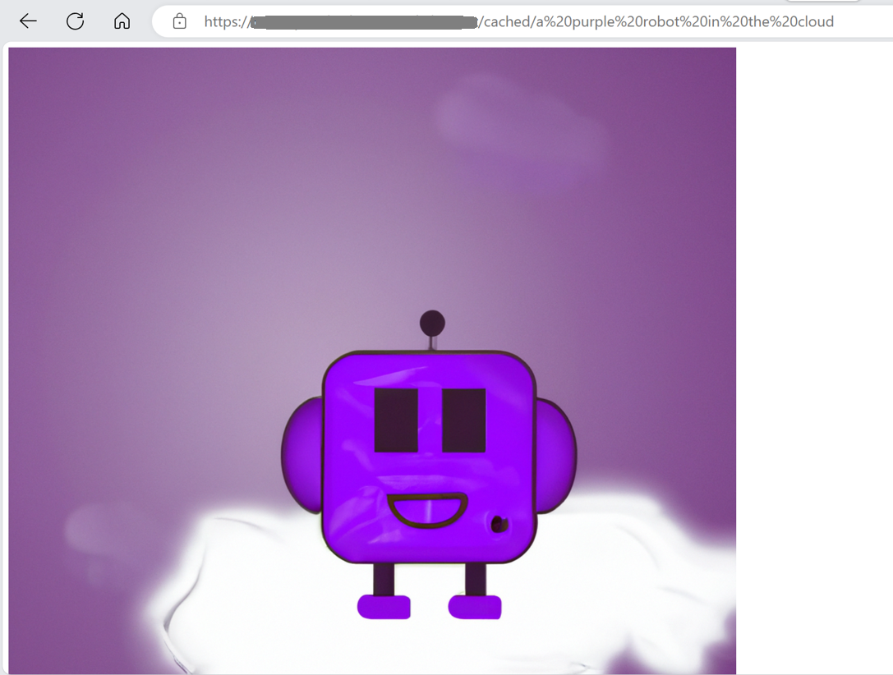
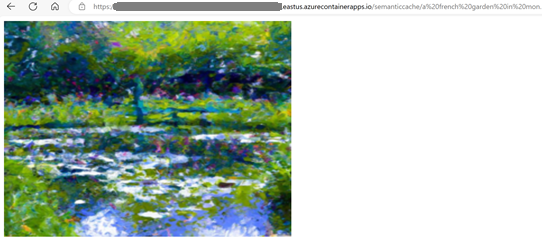
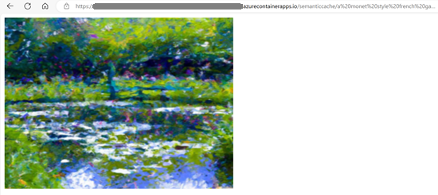

# .NET 8 Web Application with Redis Output Caching and Azure Open AI

## Overview
This repository contains sample code for an AI image generation web application. It calls into Azure Open AI DallE to generate images based on user prompt. There are two features the sample highlights:
* It allows responses from the /cached/ endpoint to be saved in Azure Cache for Redis through the [IOutputCache() abstraction](https://learn.microsoft.com/aspnet/core/performance/caching/output?preserve-view=true&view=aspnetcore-8.0#cache-storage). 
* It uses semantic caching to cache responses from similar prompts using the [Redis OM for .NET](https://github.com/redis/redis-om-dotnet)

## Getting Started

Prerequisites:
- Azure subscription. [Start free](https://azure.microsoft.com/free)
- .NET 9. [Download](https://dotnet.microsoft.com/download/dotnet/9.0)
- Docker. [Get docker](https://docs.docker.com/get-docker/)
- Azure Developer CLI. [Install](https://learn.microsoft.com/azure/developer/azure-developer-cli/install-azd?tabs=winget-windows%2Cbrew-mac%2Cscript-linux&pivots=os-windows)

### Running this sample

1. Open a command prompt
1. Change directory to the project folder where azure.yaml file is located
1. Make sure docker is running
1. Run:
    ```
    azd up
    ```
1. Follow command prompt to enter environment name and select subscription
1. This will create all the resources needed to run the sample:
- Azure Container App instance and environment
- Azure Container Registry
- Azure Open AI service
- Azure Cache for Redis Enterprise
- Azure Key Vault


## Guidance
deploy this demo in the East US region to ensure both zonal support and Dall-E model available. DALL-E model for picture generation is only supported among East US, Australia East, or Sweden Central. Azure Cache for Redis needs a region with zonal support to work.


## Features

To experiment with the demo:
1. call the /nocache/ endpoint with your command prompt. Refresh the browser. Observe that refresh takes a noticeable delay and a new picture will be generated.
1. call the /cached/ endpoint with your command prompt. Refresh the browser. Observe that the output picture does not change and refresh finishes instantly. 
1. call the /semanticcache/ endpoint with your command prompt. Enter two similar prompts such as "a french garden in monet style" and "a monet style french garden". Observe that the outputs are cached. 

Here are an example outputs:

**Figure 1**: /cached/ endpoint caches web response rendered output



**Figure 2**: /semanticcache/ endpoint for "a french garden in monet style"



**Figure 3**: /semanticcache/ endpoiont for "a monet style french garden". Observe with semantic caching, the output is the same as Figure 2 above.



## Clean up Azure resources

1. To clean up the environment, run 
    ```
    azd down
    ```

## Important Security Notice

This template, the application code and configuration it contains, has been built to showcase Microsoft Azure specific services and tools. We strongly advise our customers not to make this code part of their production environments without implementing or enabling additional security features. 

## Resources
Read more about Azure Redis at [What is Azure Cache for Redis](https://learn.microsoft.com/azure/azure-cache-for-redis/cache-overview)